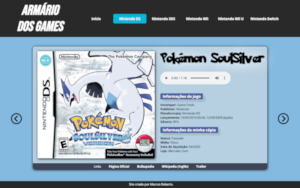

<h1>Armário dos Games</h1>

Meu primeiro projeto feito em HTML5 e CSS3. Aqui utilizo os conceitos e técnicas aprendidas no curso do <a href="">Prof. Gustavo Guanabara</a> do Curso em Vídeo. Foi um projeto muito interessante para treinar responsividade em várias telas, paleta de cores e trabalhar com fontes externas.